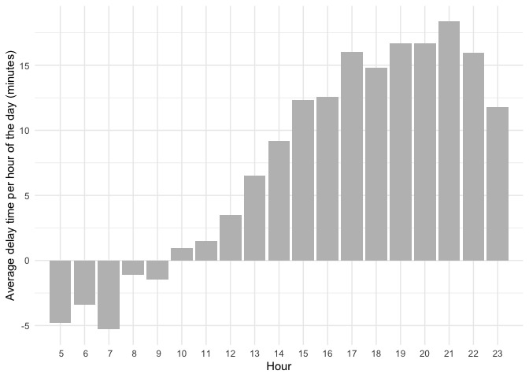
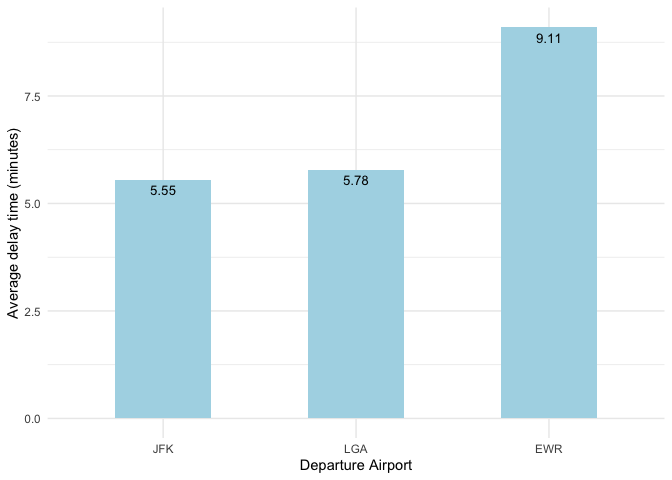
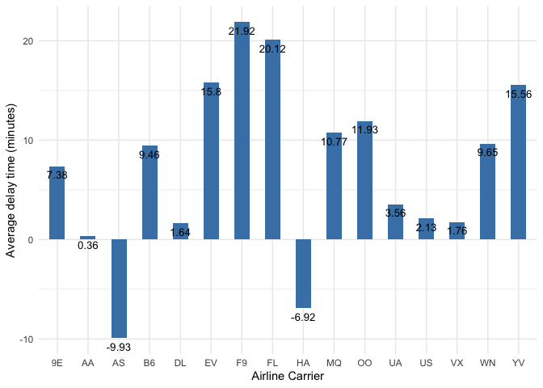

STAT433 HW3
================
Lexi Luo
10/5/2021

### Week4 HW3

<https://github.com/QLexiLuo/STAT433-HW3>

##### In r4ds flights… What time of day should you fly if you want to avoid delays as much as possible? Does this choice depend on anything? Season? Weather? Airport? Airline? Find three patterns (“null results” are ok!). Write your results into Rmarkdown. Include a short introduction that summarizes the three results. Then, have a section for each finding. Support each finding with data summaries and visualizations. Include your code when necessary. This shouldn’t be long, but it might take some time to find the things you want to talk about and lay them out in an orderly way.

``` r
library(nycflights13)
```

    ## Warning: package 'nycflights13' was built under R version 3.6.2

``` r
library(dplyr)
```

    ## Warning: package 'dplyr' was built under R version 3.6.2

    ## 
    ## Attaching package: 'dplyr'

    ## The following objects are masked from 'package:stats':
    ## 
    ##     filter, lag

    ## The following objects are masked from 'package:base':
    ## 
    ##     intersect, setdiff, setequal, union

``` r
library(ggplot2)
```

    ## Warning: package 'ggplot2' was built under R version 3.6.2

#### Summary

###### Leave in the Morning, fly Alaska Airlines Inc., and fly from JFK airport may avoid delays as much as possible.

#### time of day

``` r
avgdelay = flights %>%
  group_by(hour) %>%
  summarise(n = n(), arr_delay = mean(arr_delay, na.rm = TRUE)) %>%
  arrange(arr_delay) 
```

    ## `summarise()` ungrouping output (override with `.groups` argument)

``` r
ggplot(data = avgdelay, aes(x= hour, y = arr_delay)) + 
  geom_bar(stat="identity", fill="grey") + 
  ylab('Average delay time per hour of the day (minutes)') +
  xlab('Hour') +
  theme_minimal() +
  scale_x_discrete(limits=avgdelay$hour)
```

    ## Warning: Continuous limits supplied to discrete scale.
    ## Did you mean `limits = factor(...)` or `scale_*_continuous()`?

    ## Warning: Removed 1 rows containing missing values (position_stack).

<!-- -->

This graph shows Hour vs. Average delay time per hour of the day, which
demonstrated that morning flights before 10 am all have a negative delay
time. 7 am flights had a lowest average delay time, which means people
should take the 7 am flights if they want to avoid delays as much as
possible.

#### Departure Airport

``` r
delay_airport= flights %>%
  group_by(origin) %>%
  summarise(n = n(), arr_delay = mean(arr_delay, na.rm = TRUE)) %>%
  arrange(arr_delay) 
```

    ## `summarise()` ungrouping output (override with `.groups` argument)

``` r
ggplot(data = delay_airport, aes(x= origin, y = arr_delay)) + 
  geom_bar(stat="identity", fill="light blue", width = 0.5) + 
  ylab('Average delay time (minutes)') +
  xlab('Departure Airport') +
  theme_minimal() +
  scale_x_discrete(limits=delay_airport$origin) +
  geom_text(aes(label=round(arr_delay,2)), vjust=1.6, color="black", size=3.5)
```

<!-- -->

This graph shows Departure Airport vs. Average delay time for each
airport, which demonstrated that JFK airport have the lowest average
delay time in minutes, so people should fly from JFK if they want to
avoid delays as much as possible.

#### Airline Carrier

``` r
delay_carrier= flights %>%
  group_by(carrier) %>%
  summarise(n = n(), arr_delay = mean(arr_delay, na.rm = TRUE)) %>%
  arrange(arr_delay) 
```

    ## `summarise()` ungrouping output (override with `.groups` argument)

``` r
ggplot(data = delay_carrier, aes(x= carrier, y = arr_delay)) + 
  geom_bar(stat="identity", fill="steelblue", width = 0.5) + 
  ylab('Average delay time (minutes)') +
  xlab('Airline Carrier') +
  theme_minimal() +
  scale_x_discrete(limits=delay_airport$carrier) +
  geom_text(aes(label=round(arr_delay,2)), vjust=1.6, color="black", size=3.5)
```

    ## Warning: Unknown or uninitialised column: `carrier`.

<!-- -->

This graph shows Airline Carrier vs. Average delay time for each
carrier, which demonstrated that Alaska Airlines Inc. has the lowest
average delay time in minutes, so people should fly Alaska Airlines if
they want to avoid delays as much as possible.
